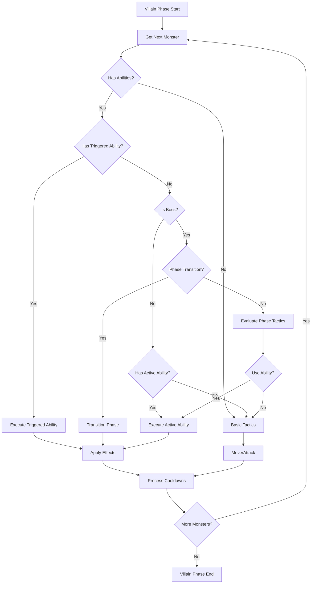

# Advanced Monster AI Implementation Plan

**Created:** 2026-03-19
**Priority:** HIGH
**Complexity:** HIGH

---

## Overview

This plan details the implementation of Advanced Monster AI for the Castle Ravenloft digital game. The Advanced Monster AI will add special abilities, boss-specific tactics, and more sophisticated monster behaviors to create deeper, more engaging combat encounters.

---

## Objectives

1. Implement a flexible special abilities system for monsters
2. Create boss-specific tactics and phase transitions
3. Add common monster abilities from the board game
4. Integrate abilities into the existing monster AI framework
5. Maintain immutability and pure function patterns

---

## Architecture

### System Components

```
┌─────────────────────────────────────────────────────────────┐
│                     Monster Activation                       │
│                  (Villain Phase Queue)                      │
└────────────────────┬────────────────────────────────────────┘
                     │
                     ▼
┌─────────────────────────────────────────────────────────────┐
│                   resolveTactic()                           │
│              (src/game/engine/MonsterAI.ts)                 │
└────────────────────┬────────────────────────────────────────┘
                     │
                     ▼
┌─────────────────────────────────────────────────────────────┐
│              Monster Behavior Evaluation                     │
│         (conditions → actions → tactics)                     │
└────────────────────┬────────────────────────────────────────┘
                     │
         ┌───────────┴───────────┐
         ▼                       ▼
┌──────────────────┐    ┌──────────────────┐
│ Basic Tactics    │    │ Special Abilities │
│ (move, attack)  │    │  (NEW)           │
└──────────────────┘    └────────┬─────────┘
                                 │
                                 ▼
                    ┌──────────────────────────┐
                    │   AbilitySystem         │
                    │   (executeAbility())    │
                    └────────┬─────────────────┘
                             │
                             ▼
                    ┌──────────────────────────┐
                    │   Ability Effects       │
                    │   (damage, condition,   │
                    │    summon, etc.)        │
                    └──────────────────────────┘
```

---

## Phase 1: Type Definitions

### 1.1 Add Ability Types to [`src/game/types.ts`](../src/game/types.ts)

```typescript
// Ability types
export type AbilityType = 'passive' | 'active' | 'triggered';
export type AbilityTrigger = 'on_turn_start' | 'on_turn_end' | 'on_damage_taken' | 'on_damage_dealt' | 'on_death' | 'on_spawn' | 'on_low_hp';

// Ability effect types
export type AbilityEffectType = 'damage' | 'heal' | 'condition' | 'move' | 'summon' | 'buff' | 'debuff' | 'teleport' | 'push' | 'pull';

// Ability target types
export type AbilityTarget = 'self' | 'closest_hero' | 'all_heroes' | 'all_monsters' | 'adjacent_heroes' | 'adjacent_monsters' | 'tile' | 'random_hero';

// Monster ability interface
export interface MonsterAbility {
  id: string;
  name: string;
  description: string;
  type: AbilityType;
  trigger?: AbilityTrigger;
  cooldown?: number; // Turns between uses
  currentCooldown?: number;
  uses?: number; // Limited uses (e.g., "once per encounter")
  effects: AbilityEffect[];
}

// Ability effect interface
export interface AbilityEffect {
  type: AbilityEffectType;
  target: AbilityTarget;
  value?: number;
  condition?: ConditionType;
  duration?: number;
  range?: number; // Tiles or squares
  aoe?: boolean; // Area of effect
}

// Boss phase interface (enhanced)
export interface BossPhase {
  id: string;
  className: string;
  hpThreshold: number; // 0.0 to 1.0
  triggers: string[];
  abilities: string[];
  tactics: TacticPattern[];
  passiveAbilities?: string[];
}

// Tactic pattern for boss-specific behaviors
export interface TacticPattern {
  condition: string;
  actions: string[];
  ability?: string; // Ability to use
}

// Enhanced Monster interface
export interface Monster extends Entity {
  type: 'monster';
  monsterType: string;
  behavior: MonsterBehavior;
  attackBonus: number;
  damage: number;
  experienceValue: number;
  ownedByHeroId: string | null;
  moveRange?: number;
  abilities?: MonsterAbility[]; // NEW: Monster abilities
  currentPhase?: string; // NEW: For boss phases
  isBoss?: boolean; // NEW: Boss flag
}
```

---

## Phase 2: Ability System

### 2.1 Create [`src/game/ai/AbilitySystem.ts`](../src/game/ai/AbilitySystem.ts)

**Purpose:** Core system for executing monster abilities

**Key Methods:**
- `executeAbility(ability, monster, gameState): GameState` - Execute an ability and return new state
- `canUseAbility(ability, monster, gameState): boolean` - Check if ability can be used
- `applyAbilityEffect(effect, source, target, gameState): GameState` - Apply a single effect
- `getAbilityTargets(ability, monster, gameState): Entity[]` - Get valid targets for ability
- `processCooldowns(monster, gameState): GameState` - Decrement cooldowns at end of turn

**Implementation Notes:**
- Pure functions only - no mutation
- Return new GameState with changes applied
- Handle all effect types: damage, heal, condition, summon, etc.
- Support area-of-effect abilities
- Track cooldowns and uses

### 2.2 Create [`src/game/ai/behaviors/AbilityLibrary.ts`](../src/game/ai/behaviors/AbilityLibrary.ts)

**Purpose:** Library of common monster abilities from the board game

**Abilities to Implement:**

| Ability | Type | Effect | Monster |
|---------|------|--------|---------|
| Undying | Triggered | On death: roll d20, on 15+ return to 1 HP | Skeleton, Zombie |
| Plague Aura | Passive | Heroes adjacent take 1 poison damage at start of turn | Ghoul |
| Vampiric Bite | Active | Heal for damage dealt | Vampire |
| Mist Form | Active | Teleport to any tile with a hero | Vampire |
| Regeneration | Passive | Heal 1 HP at start of turn | Troll, Vampire |
| Fire Breath | Active | Cone attack, 2 damage to all heroes in cone | Dragon |
| Summon | Active | Spawn 1-2 minions | Necromancer |
| Fear Aura | Passive | Heroes adjacent must roll or be stunned | Dragon, Strahd |
| Drain Life | Active | Deal 2 damage, heal 1 HP | Vampire, Wraith |
| Web | Active | Target hero is immobilized (save ends) | Spider |
| Poison Cloud | Active | All heroes on tile take 1 poison damage | Green Dragon |
| Howl | Active | All heroes must roll or be dazed | Werewolf |

**Data Structure:**
```typescript
export const ABILITY_LIBRARY: Record<string, MonsterAbility> = {
  undying: {
    id: 'undying',
    name: 'Undying',
    description: 'When reduced to 0 HP, roll d20. On 15+, return to 1 HP.',
    type: 'triggered',
    trigger: 'on_death',
    effects: [
      {
        type: 'heal',
        target: 'self',
        value: 1,
        condition: 'roll_15_plus' // Special conditional effect
      }
    ]
  },
  // ... more abilities
};
```

---

## Phase 3: Boss Tactics

### 3.1 Enhance [`src/game/ai/BossPhases.ts`](../src/game/ai/BossPhases.ts)

**Current State:** Basic structure exists with phase definitions

**Enhancements Needed:**
- Add phase-specific tactics
- Add passive abilities per phase
- Implement phase transition logic
- Add boss-specific behavior patterns

**New Methods:**
- `getCurrentPhase(monster, gameState): BossPhase | null` - Get current boss phase
- `shouldTransitionPhase(monster, gameState): boolean` - Check if phase should change
- `transitionPhase(monster, newPhaseId, gameState): GameState` - Transition to new phase
- `getPhaseTactics(monster, gameState): TacticPattern[]` - Get tactics for current phase

### 3.2 Create [`src/game/ai/behaviors/BossTactics.ts`](../src/game/ai/behaviors/BossTactics.ts)

**Purpose:** Boss-specific AI behaviors and tactics

**Bosses to Implement:**

1. **Strahd von Zarovich**
   - Phase 1: "The Lord of Ravenloft" (100% - 50% HP)
     - Tactics: Move toward closest hero, attack
     - Abilities: Fireball, Summon Skeletons
   - Phase 2: "The Ancient Fear" (50% - 0% HP)
     - Tactics: Use abilities more frequently, teleport
     - Abilities: Vampiric Bite, Mist Form, Multiattack

2. **Vampire Lord**
   - Phase 1: "Bloodweaver" (100% - 30% HP)
     - Tactics: Drain life, summon bats
     - Abilities: Drain Life, Summon Bats
   - Phase 2: "Sanguine Beast" (30% - 0% HP)
     - Tactics: Aggressive attacks, regeneration
     - Abilities: Blood Frenzy, Regeneration

3. **Young Red Dragon**
   - Single phase boss
   - Tactics: Breath weapon, claw attacks
   - Abilities: Fire Breath, Fear Aura

**Boss Tactics Data Structure:**
```typescript
export const BOSS_TACTICS: Record<string, BossTactics> = {
  strahd: {
    phases: [
      {
        id: 'p1',
        className: 'The Lord of Ravenloft',
        hpThreshold: 1.0,
        triggers: ['start'],
        abilities: ['fireball', 'summon_skeletons'],
        tactics: [
          {
            condition: 'within_1_tile_of_hero',
            actions: ['attack'],
            ability: 'fireball'
          },
          {
            condition: 'always',
            actions: ['move_toward_closest_hero']
          }
        ]
      },
      {
        id: 'p2',
        className: 'The Ancient Fear',
        hpThreshold: 0.5,
        triggers: ['half_hp'],
        abilities: ['vampiric_bite', 'mist_form', 'multiattack'],
        tactics: [
          {
            condition: 'hp_below_50_percent',
            actions: ['use_ability'],
            ability: 'mist_form'
          },
          {
            condition: 'adjacent_to_hero',
            actions: ['attack', 'use_ability'],
            ability: 'vampiric_bite'
          }
        ]
      }
    ]
  },
  // ... more bosses
};
```

---

## Phase 4: Integration with Existing AI

### 4.1 Update [`src/game/engine/MonsterAI.ts`](../src/game/engine/MonsterAI.ts)

**Current State:** Basic `resolveTactic()` function handles move, attack, move_then_attack, idle

**Enhancements Needed:**
- Add 'use_ability' action type to `TacticResult`
- Integrate ability execution into tactic resolution
- Check ability cooldowns before using
- Handle triggered abilities (on_turn_start, on_turn_end, on_damage_taken, etc.)

**Updated TacticResult Type:**
```typescript
export type TacticResult =
  | { action: 'move'; path: Tile[] }
  | { action: 'attack'; targetHeroId: string; damage: number }
  | { action: 'move_then_attack'; path: Tile[]; targetHeroId: string; damage: number }
  | { action: 'idle' }
  | { action: 'use_ability'; abilityId: string; targetId?: string; effects: AbilityEffect[] }; // NEW
```

**Updated resolveTactic() Logic:**
```typescript
export function resolveTactic(
  monster: Monster,
  monsterTile: Tile,
  gameState: GameState
): TacticResult {
  // 1. Check for triggered abilities (on_turn_start)
  const triggeredAbilities = monster.abilities?.filter(
    a => a.type === 'triggered' && a.trigger === 'on_turn_start'
  );
  if (triggeredAbilities && triggeredAbilities.length > 0) {
    // Execute triggered abilities
    return {
      action: 'use_ability',
      abilityId: triggeredAbilities[0].id,
      effects: triggeredAbilities[0].effects
    };
  }

  // 2. Check boss phase tactics
  if (monster.isBoss) {
    const bossPhase = BossPhases.getCurrentPhase(monster, gameState);
    if (bossPhase) {
      // Evaluate phase-specific tactics
      for (const tactic of bossPhase.tactics) {
        if (evaluateCondition(tactic.condition, monster, gameState)) {
          if (tactic.ability) {
            // Check if ability can be used
            const ability = monster.abilities?.find(a => a.id === tactic.ability);
            if (ability && AbilitySystem.canUseAbility(ability, monster, gameState)) {
              return {
                action: 'use_ability',
                abilityId: ability.id,
                effects: ability.effects
              };
            }
          }
          // Fall through to basic tactics
        }
      }
    }
  }

  // 3. Check for available active abilities
  const activeAbilities = monster.abilities?.filter(
    a => a.type === 'active' && AbilitySystem.canUseAbility(a, monster, gameState)
  );
  if (activeAbilities && activeAbilities.length > 0) {
    // Use highest priority ability
    return {
      action: 'use_ability',
      abilityId: activeAbilities[0].id,
      effects: activeAbilities[0].effects
    };
  }

  // 4. Fall back to basic tactics (existing logic)
  // ... existing move/attack logic
}
```

### 4.2 Update [`src/store/gameStore.ts`](../src/store/gameStore.ts)

**Current State:** `executeVillainPhase()` processes monster actions

**Enhancements Needed:**
- Handle 'use_ability' action type
- Apply ability effects to game state
- Process triggered abilities at appropriate times
- Update cooldowns at end of villain phase

**Updated executeVillainPhase() Logic:**
```typescript
// Inside the monster activation loop
if (monster) {
  const result = resolveTactic(monster, monsterTile, newState);

  if (result.action === 'use_ability') {
    // Execute ability
    const ability = monster.abilities?.find(a => a.id === result.abilityId);
    if (ability) {
      newState = AbilitySystem.executeAbility(ability, monster, newState);
    }
  } else if (result.action === 'move' || result.action === 'move_then_attack') {
    // ... existing move logic
  } else if (result.action === 'attack' || result.action === 'move_then_attack') {
    // ... existing attack logic
  }

  // Process cooldowns at end of monster's turn
  newState = AbilitySystem.processCooldowns(monster, newState);
}
```

---

## Phase 5: Monster Data Updates

### 5.1 Update [`src/data/monsters.json`](../src/data/monsters.json)

**Current State:** Basic monster stats with behavior

**Enhancements Needed:**
- Add abilities array to each monster
- Add isBoss flag for boss monsters
- Add currentPhase field for bosses

**Example Updates:**

```json
{
  "id": "monster_skeleton",
  "name": "Skeleton",
  "type": "monster",
  "monsterType": "Undead",
  "hp": 1,
  "maxHp": 1,
  "ac": 14,
  "speed": 1,
  "attackBonus": 7,
  "damage": 1,
  "experienceValue": 1,
  "moveRange": 1,
  "isBoss": false,
  "abilities": [
    {
      "id": "undying",
      "name": "Undying",
      "description": "When reduced to 0 HP, roll d20. On 15+, return to 1 HP.",
      "type": "triggered",
      "trigger": "on_death",
      "effects": [
        {
          "type": "heal",
          "target": "self",
          "value": 1,
          "condition": "roll_15_plus"
        }
      ]
    }
  ],
  "behavior": {
    "conditions": ["adjacent_to_hero", "within_1_tile"],
    "priorityTargets": ["lowest_hp"],
    "actions": ["attack", "move_toward"]
  }
}
```

### 5.2 Create [`src/data/boss-phases.json`](../src/data/boss-phases.json)

**Purpose:** Boss phase definitions separate from monster data

**Structure:**
```json
{
  "strahd": [
    {
      "id": "p1",
      "className": "The Lord of Ravenloft",
      "hpThreshold": 1.0,
      "triggers": ["start"],
      "abilities": ["fireball", "summon_skeletons"],
      "tactics": [
        {
          "condition": "within_1_tile_of_hero",
          "actions": ["attack"],
          "ability": "fireball"
        },
        {
          "condition": "always",
          "actions": ["move_toward_closest_hero"]
        }
      ]
    },
    {
      "id": "p2",
      "className": "The Ancient Fear",
      "hpThreshold": 0.5,
      "triggers": ["half_hp"],
      "abilities": ["vampiric_bite", "mist_form", "multiattack"],
      "tactics": [
        {
          "condition": "hp_below_50_percent",
          "actions": ["use_ability"],
          "ability": "mist_form"
        }
      ]
    }
  ]
}
```

---

## Phase 6: Testing

### 6.1 Unit Tests

Create [`src/testing/ability-system-tests.ts`](../src/testing/ability-system-tests.ts)

**Test Cases:**
- Ability execution with various effect types
- Cooldown tracking and decrementing
- Ability target selection
- Triggered ability timing
- Boss phase transitions
- Passive ability effects

### 6.2 Integration Tests

Update [`src/testing/integrationTests.ts`](../src/testing/integrationTests.ts)

**Test Cases:**
- Monster with undying ability
- Boss phase transition
- Boss using special abilities
- Multiple monsters with different abilities
- Passive aura effects

---

## Implementation Order

### Step 1: Type Definitions (1 task)
- [ ] Add ability types to [`src/game/types.ts`](../src/game/types.ts)

### Step 2: Ability System Core (3 tasks)
- [ ] Create [`src/game/ai/AbilitySystem.ts`](../src/game/ai/AbilitySystem.ts)
- [ ] Implement ability execution logic
- [ ] Implement cooldown and use tracking

### Step 3: Ability Library (1 task)
- [ ] Create [`src/game/ai/behaviors/AbilityLibrary.ts`](../src/game/ai/behaviors/AbilityLibrary.ts)
- [ ] Implement common monster abilities (10-15 abilities)

### Step 4: Boss Tactics (2 tasks)
- [ ] Enhance [`src/game/ai/BossPhases.ts`](../src/game/ai/BossPhases.ts)
- [ ] Create [`src/game/ai/behaviors/BossTactics.ts`](../src/game/ai/behaviors/BossTactics.ts)
- [ ] Implement boss-specific tactics for 2-3 bosses

### Step 5: AI Integration (2 tasks)
- [ ] Update [`src/game/engine/MonsterAI.ts`](../src/game/engine/MonsterAI.ts)
- [ ] Update [`src/store/gameStore.ts`](../src/store/gameStore.ts)

### Step 6: Data Updates (2 tasks)
- [ ] Update [`src/data/monsters.json`](../src/data/monsters.json) with abilities
- [ ] Create [`src/data/boss-phases.json`](../src/data/boss-phases.json)

### Step 7: Testing (2 tasks)
- [ ] Create unit tests for ability system
- [ ] Update integration tests

---

## File Structure

```
src/
├── game/
│   ├── types.ts                          (UPDATE - add ability types)
│   ├── ai/
│   │   ├── AbilitySystem.ts              (NEW - core ability execution)
│   │   ├── MonsterAI.ts                  (EXISTING - basic tactics)
│   │   ├── BossPhases.ts                 (UPDATE - enhance phase system)
│   │   ├── Pathfinding.ts                (EXISTING)
│   │   ├── ThreatAssessment.ts           (EXISTING)
│   │   └── behaviors/                    (NEW directory)
│   │       ├── AbilityLibrary.ts         (NEW - ability definitions)
│   │       └── BossTactics.ts            (NEW - boss-specific tactics)
│   └── engine/
│       └── MonsterAI.ts                  (UPDATE - integrate abilities)
├── data/
│   ├── monsters.json                     (UPDATE - add abilities)
│   └── boss-phases.json                  (NEW - boss phase data)
└── store/
    └── gameStore.ts                      (UPDATE - handle ability actions)
```

---

## Mermaid Diagram: Monster AI Flow



---

## Notes

- All functions must be pure - no mutation, return new state
- Follow existing singleton pattern where appropriate
- Use Zustand store for state management
- Maintain compatibility with existing systems
- Test thoroughly before integrating with UI
- Document all ability effects and triggers
- Consider balance when implementing abilities

---

## Success Criteria

1. ✅ Monsters can use special abilities during their turn
2. ✅ Bosses have unique tactics and phase transitions
3. ✅ Triggered abilities execute at appropriate times
4. ✅ Cooldowns and limited uses are tracked correctly
5. ✅ Ability effects apply correctly to game state
6. ✅ Existing monster AI continues to work
7. ✅ All tests pass
8. ✅ No breaking changes to existing systems
