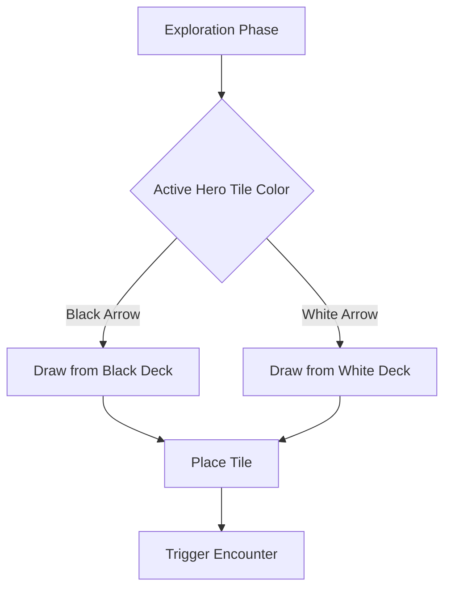

# Tile Import Plan for Castle Ravenloft

## Overview

This document outlines the strategy for importing the new tile assets into the game. The PNG assets are already present in `public/assets/tiles/`, but [`src/data/tiles.json`](src/data/tiles.json) needs to be expanded with proper tile definitions.

## Asset Summary

### Named Tiles (Type 5) - 8 tiles

Special rooms with unique encounter effects. Drawn from the **White** deck.

| Tile Name | Filename | Connection Pattern |
|-----------|----------|-------------------|
| Arcane Circle | Named_ArcaneCircle.png | TBD from image |
| Chapel | Named_Chapel.png | TBD from image |
| Dark Fountain | Named_DarkFountain.png | TBD from image |
| Fetid Den | Named_FetidDen.png | TBD from image |
| Laboratory | Named_Laboratory.png | TBD from image |
| Rotting Nook | Named_RottingNook.png | TBD from image |
| Secret Stairway | Named_SecretStairway.png | TBD from image |
| Workshop | Named_Workshop.png | TBD from image |

### Crypt Tiles (Type 6) - 12 tiles

Crypt chambers and corner markers. Drawn from the **White** deck.

| Tile Name | Filename | Notes |
|-----------|----------|-------|
| Crypt Corner 1-5 | Crypt_Corner1-5.png | Corner marker tiles |
| Crypt Corner 6-10 | Crypt_Corner6-10.png | Corner marker tiles |
| Crypt Corner 11-15 | Crypt_Corner11-15.png | Corner marker tiles |
| Crypt Corner 16-20 | Crypt_Corner16-20.png | Corner marker tiles |
| Crypt of Artimus | Crypt_CryptOfArtimus.png | Named crypt |
| Crypt of Barov and Ravenovia | Crypt_CryptOfBarovAndRavenovia.png | Named crypt |
| Crypt of Sergei Von Zarovich | Crypt_CryptOfSergeiVonZarovich.png | Named crypt |
| Ireena Kolyanas Crypt | Crypt_IreenaKolyanasCrypt.png | Named crypt |
| Kings Crypt | Crypt_KingsCrypt.png | Named crypt |
| Lonely Crypt | Crypt_LonelyCrypt.png | Named crypt |
| Prince Aurels Crypt | Crypt_PrinceAurelsCrypt.png | Named crypt |
| Strahds Crypt | Crypt_StrahdsCrypt.png | Named crypt - boss room |

### Normal Black Tiles (Type 4) - 11 tiles

Standard dungeon tiles drawn from the **Black** deck.

| Pattern | Count | Files | Typical Connections |
|---------|-------|-------|---------------------|
| x2 | 4 | Tile_Black_x2_01-04.png | 2 exits - corridor style |
| x3 | 2 | Tile_Black_x3_01-02.png | 3 exits - T-junction |
| x4 | 6 | Tile_Black_x4_01-06.png | 4 exits - crossroads |

### Normal White Tiles (Type 4) - 8 tiles

Standard dungeon tiles drawn from the **White** deck.

| Pattern | Count | Files | Typical Connections |
|---------|-------|-------|---------------------|
| x2 | 3 | Tile_White_x2_01-03.png | 2 exits - corridor style |
| x3 | 5 | Tile_White_x3_01-05.png | 3 exits - T-junction |

---

## Architecture Changes Required

### 1. Update Tile Type Definition

Current [`src/game/types.ts`](src/game/types.ts:110) defines:

```typescript
terrainType: 'corridor' | 'named_room' | 'boss_room';
```

Proposed expansion:

```typescript
terrainType: 'corridor' | 'named_room' | 'boss_room' | 'crypt' | 'special';
encounterType: 'black' | 'white';
```

### 2. Tile Deck System

Create a tile drawing system that respects the black/white deck split:



### 3. Tile Data Structure

Each tile entry in `tiles.json` needs:

```typescript
interface TileDefinition {
  id: string;              // Unique identifier
  name: string;            // Display name
  terrainType: TerrainType;
  encounterType: 'black' | 'white';
  connections: TileConnection[];
  imageUrl: string;        // Path to texture
  boneSquare?: Position;   // Where to place bone pile
  specialEffect?: string;  // For named tiles
  isStart?: boolean;
  isExit?: boolean;
  rotation: Rotation;
}
```

---

## Implementation Steps

### Phase 1: Data Entry

1. **Analyze tile images** to determine connection patterns for each tile
2. **Create tile definitions** in `tiles.json` for all 39+ tiles
3. **Categorize by deck** - black vs white encounter type

### Phase 2: Deck System

1. Create `TileDeck` class in `src/game/engine/TileDeck.ts`
2. Implement shuffle and draw mechanics
3. Separate black/white deck instances

### Phase 3: Integration

1. Update [`Tile3D.tsx`](src/components/3d/Tile3D.tsx:1) to handle new terrain types
2. Update [`ExplorationLayer.tsx`](src/components/3d/ExplorationLayer.tsx) to use deck system
3. Add special effect triggers for named tiles

---

## Connection Pattern Analysis Needed

The x2/x3/x4 naming indicates exit count, but exact edge configurations need to be determined by examining the tile images. Common patterns:

- **x2 Corridor**: North-South OR East-West
- **x3 T-Junction**: North-East-South OR East-South-West etc.
- **x4 Crossroads**: All 4 edges open

---

## File Structure After Import

```
public/assets/tiles/
├── StartTile.png
├── StartTileBack.png
├── Tile_Back.png
├── Named_*.png (8 files)
├── Crypt_*.png (12 files)
├── Tile_Black_*.png (11 files)
└── Tile_White_*.png (8 files)

src/data/
└── tiles.json (expanded with all definitions)

src/game/engine/
└── TileDeck.ts (new - deck management)
```

---

## Questions for Clarification

1. **Connection Patterns**: Should I analyze each tile image to determine exact edge connections, or is there documentation available?

2. **Special Effects**: What special effects should each Named Tile have? The board game has specific rules for each.

3. **Crypt Corners**: The Crypt Corner 1-5/6-10/11-15/16-20 tiles appear to be markers. How should these be used?

4. **Tile Backs**: Should `Tile_Back.png` and `StartTileBack.png` be used for unrevealed tile visualization?

5. **Deck Composition**: Should the decks be built dynamically based on scenario, or use a fixed composition?
