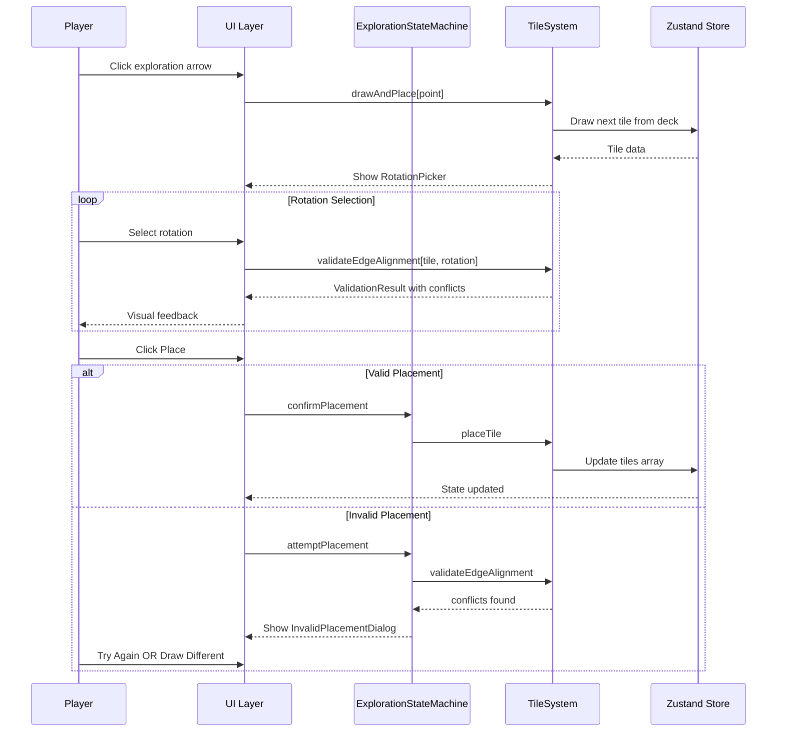

# Validation-Based Tile Placement System

## Overview

This plan transforms the tile placement system from **pre-filtered placement** (system finds a tile that fits, shows only valid rotations) to **validation-based placement** (draw any tile, let player rotate freely, validate on placement attempt).

## Current vs. Proposed Flow

### Current Flow (Pre-filtered)

```
Player explores edge
        ↓
System scans deck for FIRST tile that CAN fit
        ↓
Show RotationPicker with ONLY valid rotations
        ↓
Player picks rotation
        ↓
Tile placed (guaranteed to fit)
```

### Proposed Flow (Validation-Based)

```
Player explores edge
        ↓
Draw next tile from deck (random/fixed order)
        ↓
Player rotates/positions freely (all 4 rotations available)
        ↓
Player clicks "Place"
        ↓
System validates edge alignment
        ↓
   ┌─────────────────┐
   │ VALID?          │
   └─────────────────┘
     ↓           ↓
   YES          NO
     ↓           ↓
 Tile placed   Show dialog:
     ↓         "Tile doesn't fit!"
 Complete      [Try Again] [Draw Different]
```

## Architecture Changes

### 1. New Validation Method in TileSystem

**File:** `src/game/engine/TileSystem.ts`

```typescript
/**
 * Validates whether a tile can be placed at a position with given rotation.
 * Checks all edge alignments against existing neighbor tiles.
 */
public static validateEdgeAlignment(
  tiles: Tile[],
  newTile: Tile,
  targetX: number,
  targetZ: number,
  rotation: Rotation
): { 
  valid: boolean; 
  conflicts: EdgeConflict[];
  warnings: string[];
}

interface EdgeConflict {
  edge: Direction;
  issue: 'open_to_wall' | 'wall_to_open' | 'open_to_boundary';
  neighborTileId?: string;
}
```

**Validation Rules:**

1. **Primary Edge** (where player explored from): MUST have open edge facing parent
2. **Secondary Edges**: Check each neighbor
   - Open → Open = OK (connection formed)
   - Open → Wall = WARNING (blocked path)
   - Wall → Open = WARNING (orphaned opening)
   - Wall → Wall = OK
3. **Boundary Edges** (no neighbor): Open edges create new exploration points

### 2. Modified ExplorationStateMachine

**File:** `src/game/engine/ExplorationStateMachine.ts`

```typescript
export type ExplorationState =
  | { phase: 'idle' }
  | { phase: 'arrow_selected'; point: ExplorationPoint }
  | { 
      phase: 'positioning'; 
      point: ExplorationPoint;
      drawnTile: Tile;
      remainingDeck: string[];
      currentRotation: Rotation;
      validationPreview: ValidationResult | null;
    }
  | { 
      phase: 'placement_blocked';
      point: ExplorationPoint;
      drawnTile: Tile;
      remainingDeck: string[];
      currentRotation: Rotation;
      conflicts: EdgeConflict[];
    }
  | { phase: 'placing'; point: ExplorationPoint; rotation: Rotation }
  | { phase: 'exhausted' };
```

### 3. New UI Component: InvalidPlacementDialog

**File:** `src/components/ui/InvalidPlacementDialog.tsx`

```typescript
interface InvalidPlacementDialogProps {
  conflicts: EdgeConflict[];
  onTryAgain: () => void;
  onDrawDifferent: () => void;
}
```

**Visual Design:**

- Gothic-styled modal overlay
- Shows conflict details: "North edge: Open path meets solid wall"
- Two buttons: "Try Again" (primary) / "Draw Different Tile" (secondary)

### 4. Enhanced RotationPicker

**File:** `src/components/ui/RotationPicker.tsx`

**Changes:**

- Remove `validRotations` restriction
- Add `currentRotation` prop for free selection
- Add real-time validation preview
- Visual indicators:
  - Green outline = valid placement
  - Yellow outline = warnings (blocked paths)
  - Red outline = invalid (primary edge blocked)

### 5. TileSystem Helper Methods

```typescript
/**
 * Returns tile to bottom of deck and draws next tile.
 * Used when player chooses "Draw Different Tile".
 */
public static returnAndDrawNext(
  currentTile: Tile,
  currentTileCardId: string,
  deck: string[]
): { tile: Tile | null; cardId: string | null; remainingDeck: string[] };

/**
 * Gets all neighbors of a grid position.
 */
public static getNeighborTiles(
  tiles: Tile[],
  x: number,
  z: number
): Map<Direction, Tile | null>;
```

## Edge Alignment Logic

### Connection Matrix

| New Tile Edge | Neighbor Edge | Result |
|---------------|---------------|--------|
| Open          | Open          | ✅ Connection |
| Open          | Wall          | ⚠️ Blocked Path |
| Open          | None (edge)   | ✅ New Exploration Point |
| Wall          | Open          | ⚠️ Orphaned Opening |
| Wall          | Wall          | ✅ OK |
| Wall          | None (edge)   | ✅ OK |

### Critical Rule

The **primary edge** (where the player explored from) MUST connect:

- New tile MUST have open edge facing the parent tile
- If this edge is closed, placement is INVALID (not just a warning)

## Visual Feedback System

### 3D Preview in Scene

When player is positioning a tile:

1. **Ghost Tile**: Semi-transparent preview at target location
2. **Edge Highlights**:
   - Green glow = valid connection
   - Red glow = conflict
   - Yellow glow = warning
3. **Particle Effect**: Sparkles on valid placement, shake animation on invalid

### UI Feedback

1. **RotationPicker**: Border color indicates overall validity
2. **Place Button**: Disabled state with tooltip explaining conflicts
3. **Conflict Panel**: Real-time list of edge issues

## Data Flow Diagram



## Implementation Order

### Phase 1: Core Validation

1. Add `TileSystem.validateEdgeAlignment()` method
2. Add `TileSystem.getNeighborTiles()` helper
3. Add unit tests for validation logic

### Phase 2: State Machine Update

4. Modify `ExplorationStateMachine` with new phases
2. Add `positioning` and `placement_blocked` states
3. Handle "Draw Different Tile" flow

### Phase 3: UI Components

7. Create `InvalidPlacementDialog` component
2. Update `RotationPicker` for free rotation
3. Add validation preview to UI

### Phase 4: Visual Feedback

10. Add ghost tile preview in 3D scene
2. Add edge highlighting system
3. Add placement success/failure animations

### Phase 5: Integration

13. Wire up all components in gameStore
2. Test full exploration flow
3. Edge case testing

## Edge Cases to Handle

1. **Dead End Tile**: All rotations valid (only one open edge)
2. **Cross Tile**: All rotations valid (symmetric)
3. **T-Junction**: Some rotations create orphaned openings
4. **Closed Room**: Tile with all walls - always invalid for exploration
5. **Deck Exhaustion**: No more tiles to draw when player keeps rejecting
6. **Multiple Conflicts**: Show all conflicts in dialog, not just first

## Benefits of This Approach

1. **More Authentic**: Matches physical board game experience
2. **Player Agency**: Players make meaningful rotation choices
3. **Learning Curve**: Visual feedback teaches edge matching
4. **Forgiving**: "Try Again" option prevents frustration
5. **Strategic**: "Draw Different" adds tactical decision

## Files to Modify

| File | Changes |
|------|---------|
| `src/game/engine/TileSystem.ts` | Add validation methods |
| `src/game/engine/ExplorationStateMachine.ts` | New state phases |
| `src/store/gameStore.ts` | Handle bounce-back flow |
| `src/components/ui/RotationPicker.tsx` | Free rotation mode |
| `src/components/ui/InvalidPlacementDialog.tsx` | New component |
| `src/components/3d/ExplorationLayer.tsx` | Ghost tile preview |
| `src/testing/integrationTests.ts` | Validation tests |
